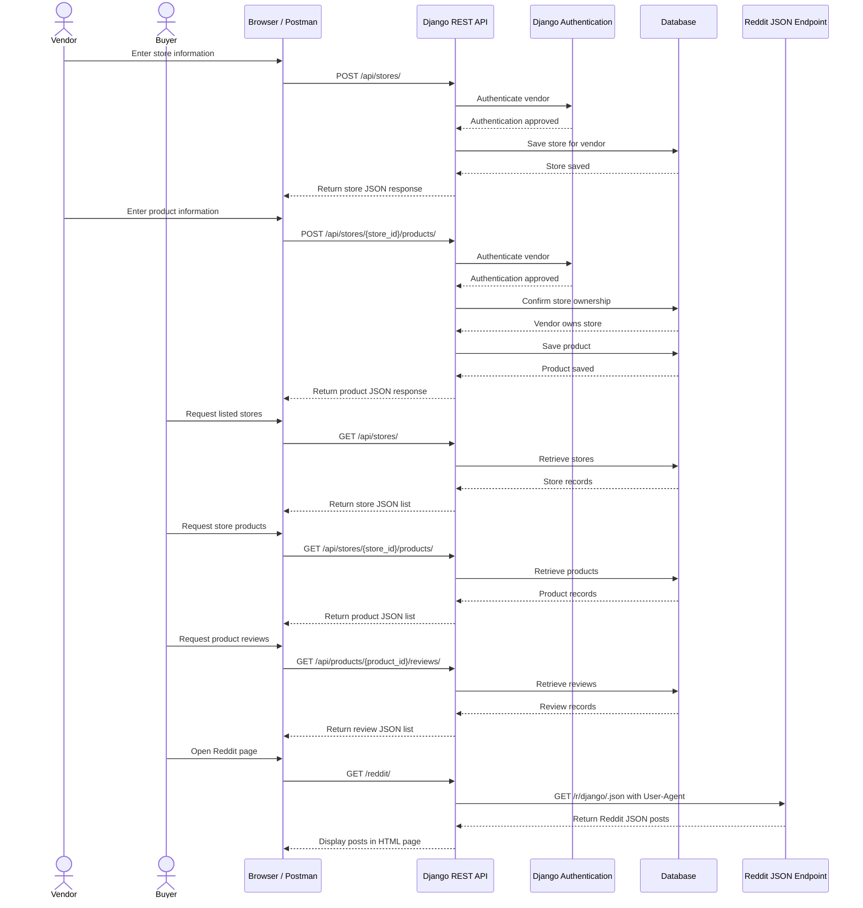

# Django eCommerce Application Part 2 — API Sequence Diagram

```mermaid
sequenceDiagram
    actor Vendor
    actor Buyer
    participant Browser as Browser / Postman
    participant API as Django REST API
    participant Auth as Django Authentication
    participant DB as Database
    participant Reddit as Reddit JSON Endpoint

    Vendor->>Browser: Enter store information
    Browser->>API: POST /api/stores/
    API->>Auth: Authenticate vendor
    Auth-->>API: Authentication approved
    API->>DB: Save store for vendor
    DB-->>API: Store saved
    API-->>Browser: Return store JSON response

    Vendor->>Browser: Enter product information
    Browser->>API: POST /api/stores/{store_id}/products/
    API->>Auth: Authenticate vendor
    Auth-->>API: Authentication approved
    API->>DB: Confirm store ownership
    DB-->>API: Vendor owns store
    API->>DB: Save product
    DB-->>API: Product saved
    API-->>Browser: Return product JSON response

    Buyer->>Browser: Request listed stores
    Browser->>API: GET /api/stores/
    API->>DB: Retrieve stores
    DB-->>API: Store records
    API-->>Browser: Return store JSON list

    Buyer->>Browser: Request store products
    Browser->>API: GET /api/stores/{store_id}/products/
    API->>DB: Retrieve products
    DB-->>API: Product records
    API-->>Browser: Return product JSON list

    Buyer->>Browser: Request product reviews
    Browser->>API: GET /api/products/{product_id}/reviews/
    API->>DB: Retrieve reviews
    DB-->>API: Review records
    API-->>Browser: Return review JSON list

    Buyer->>Browser: Open Reddit page
    Browser->>API: GET /reddit/
    API->>Reddit: GET /r/django/.json with User-Agent
    Reddit-->>API: Return Reddit JSON posts
    API-->>Browser: Display posts in HTML page
```
